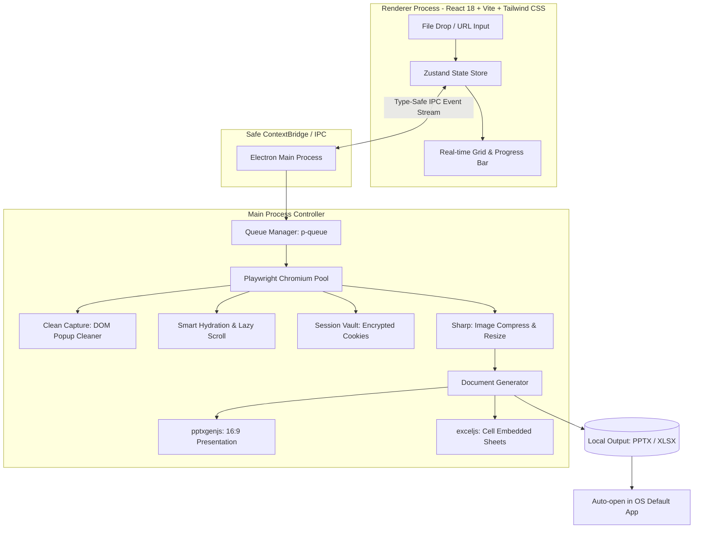

# 🛠️ SnapDeck (스냅덱) 상세 기술 및 개발 계획서
> **문서 버전:** v1.0  
> **프로젝트 성격:** 1인 개발자 최적화 데스크톱 자동화 소프트웨어 (macOS / Windows)  
> **핵심 가치:** URL 일괄 입력 ➔ 클린 고해상도 캡처 ➔ 파워포인트(PPTX) / 엑셀(XLSX) 자동 패키징

---

## 1. 시스템 아키텍처 개요 (System Architecture)

SnapDeck은 **보안성(Local-first)**, **비용 0원(서버 인프라 불필요)**, **개발 생산성(Node.js 생태계 단일 언어 활용)**을 극대화하기 위해 **Electron + TypeScript + Playwright** 기반의 데스크톱 아키텍처를 채택합니다.



### 1-1. 기술 스택 선정 이유

| 레이어 | 기술 스택 | 선정 이유 |
| :--- | :--- | :--- |
| **데스크톱 프레임워크** | **Electron (TypeScript)** | Playwright, pptxgenjs, exceljs 등 핵심 라이브러리가 모두 Node.js 기반. Tauri 사용 시 Node.js 번들링 오버헤드가 발생하므로 1인 개발 시 개발 생산성과 안정성 면에서 Electron이 압도적으로 유리. |
| **프론트엔드 UI** | **React 18 + Vite + Tailwind CSS** | 빠른 개발 속도, 모던한 다크모드/글래스모피즘 UI 구축 용이, 풍부한 컴포넌트 생태계. |
| **웹 자동화 & 캡처** | **Playwright Chromium** | Puppeteer 대비 동적 웹페이지 대기(`networkidle`, auto-wait), 모바일 에뮬레이션, 세션 쿠키 저장(`storageState`) 기능이 월등히 강력함. |
| **이미지 프로세싱** | **Sharp** | C 기반 초고속 이미지 처리 라이브러리. 캡처 이미지의 DPI 조정, PPTX 용량 폭증 방지를 위한 무손실 WebP/JPEG 압축. |
| **문서 생성** | **pptxgenjs & exceljs** | 외부 오피스 프로그램(MS Office, LibreOffice) 설치 없이도 완전한 바이너리 `.pptx`, `.xlsx` 파일을 순수 자바스크립트로 초고속 생성. |
| **빌드 & 패키징** | **electron-builder** | macOS (DMG, universal 바이너리), Windows (NSIS 설치 프로그램) 원클릭 빌드 지원. |

---

## 2. 세부 모듈 설계 및 핵심 구현 사양 (Core Modules)

### [Module 1] URL 인제스천 & 큐 관리자 (Queue & Ingestion)
사용자가 수백 개의 URL을 입력하더라도 RAM과 CPU가 폭주하지 않도록 병렬 작업을 제어합니다.

* **입력 파서**:
  * `.xlsx` / `.csv`: 첫 번째 열에서 `http://` 또는 `https://` 패턴 자동 추출.
  * `.txt` / 클립보드 텍스트: 줄바꿈(`\n`) 기준으로 분리 후 유효성 검사.
  * 중복 URL 제거 및 비정상 URL 사전 필터링.
* **동시성 제어 (`p-queue` 기반 Worker Pool)**:
  * 사용자 PC 사양에 맞춰 동시 브라우저 탭 수를 **기본 3개 ~ 최대 6개**로 동적 제한.
  * 처리 순서: URL 큐 인큐 ➔ 워커 할당 ➔ 캡처 완료 ➔ 즉시 메모리 해제 및 다음 작업 진행.

```typescript
// src/main/services/QueueManager.ts 예시 로직
import PQueue from 'p-queue';

export class QueueManager {
  private queue: PQueue;

  constructor(concurrency: number = 4) {
    this.queue = new PQueue({ concurrency });
  }

  async addJob<T>(task: () => Promise<T>): Promise<T> {
    return this.queue.add(task);
  }

  onProgress(callback: (completed: number, total: number) => void) {
    // 실시간 진행률 IPC 브로드캐스팅
  }
}
```

---

### [Module 2] 캡처 엔진 & 스마트 렌더러 (Headless Engine)
단순 스크린샷이 아니라, 실무 보고서에 쓸 수 있는 "깨끗한 고해상도 이미지"를 만드는 핵심 엔진입니다.

#### 1) 클린 캡처 (Clean Capture DOM Cleaner)
페이지 로딩 직후, 화면을 덮고 있는 쿠키 배너와 모달 팝업을 강제 제거합니다.
```typescript
// src/main/services/cleanCapture.ts
import { Page } from 'playwright';

export async function injectCleanCaptureScripts(page: Page) {
  await page.evaluate(() => {
    // 1. 대표적인 쿠키/모달/오버레이 CSS 셀렉터 패턴
    const popupSelectors = [
      '[id*="cookie" i]', '[class*="cookie" i]',
      '[id*="consent" i]', '[class*="consent" i]',
      '[id*="modal" i]', '[class*="modal" i]',
      '[aria-label*="cookie" i]', '[aria-modal="true"]',
      '#onetrust-consent-sdk', '.cookie-banner',
      '#ch-plugin', '#intercom-container' // 채널톡, 인터콤 챗봇
    ];

    popupSelectors.forEach(selector => {
      document.querySelectorAll(selector).forEach(el => {
        // 실제 화면 중앙/하단을 가리는 고정(fixed/absolute) 엘리먼트 제거
        const style = window.getComputedStyle(el);
        if (style.position === 'fixed' || style.position === 'sticky') {
          (el as HTMLElement).style.display = 'none';
        }
      });
    });

    // 2. 모달이 띄워지며 body에 걸린 스크롤 잠금 강제 해제
    document.body.style.overflow = 'auto';
    document.documentElement.style.overflow = 'auto';
  });
}
```

#### 2) 스마트 렌더링 대기 및 지연 스크롤 (Smart Hydration & Lazy-load)
```typescript
export async function capturePageSmartly(page: Page, url: string, isFullPage: boolean) {
  // 1. 초기 로딩 (DOM 컨텐츠 + 최소 네트워크 유휴)
  await page.goto(url, { waitUntil: 'domcontentloaded', timeout: 30000 });
  try {
    await page.waitForLoadState('networkidle', { timeout: 7000 });
  } catch (e) {
    // 7초 경과 시 타임아웃 무시하고 계속 진행 (광고 트래커 지연 방지)
  }

  // 2. 풀페이지 촬영 시: 레이지 로딩(Lazy-loading) 이미지 로드를 위한 고속 스크롤
  if (isFullPage) {
    await page.evaluate(async () => {
      await new Promise<void>((resolve) => {
        let totalHeight = 0;
        const distance = 400;
        const timer = setInterval(() => {
          window.scrollBy(0, distance);
          totalHeight += distance;
          if (totalHeight >= document.body.scrollHeight || totalHeight > 15000) {
            clearInterval(timer);
            window.scrollTo(0, 0); // 다시 최상단 복귀
            resolve();
          }
        }, 100);
      });
    });
    await page.waitForTimeout(500); // 렌더링 안정화 대기
  }

  // 3. 클린 캡처 스크립트 실행
  await injectCleanCaptureScripts(page);

  // 4. 메타데이터 및 스크린샷 캡처
  const title = await page.title();
  const screenshotBuffer = await page.screenshot({
    fullPage: isFullPage,
    type: 'png'
  });

  return { title, buffer: screenshotBuffer };
}
```

---

### [Module 3] 세션 금고 (Session Vault - 로그인 페이지 캡처)
* **작동 방식**:
  1. 앱 화면의 `[로그인 세션 추가]` 버튼 클릭.
  2. Electron의 독립된 `BrowserWindow`가 열리고 사용자가 대상 사이트에 수동 로그인 수행.
  3. 로그인 완료 후 창을 닫으면 Playwright의 `context.storageState()` 형식으로 쿠키, 세션, LocalStorage를 추출.
  4. Electron의 `safeStorage` API(OS의 키체인/DPAPI)를 통해 로컬 디스크에 암호화 저장.
  5. 이후 해당 도메인의 URL 캡처 시 저장된 쿠키/인증 헤더를 자동 주입하여 인트라넷 화면 캡처.

---

### [Module 4] 오피스 문서 생성 엔진 (Document Generator)

#### 1) PPTX 자동 생성기 (`pptxgenjs` 연동)
* 와이드스크린(16:9 규격: 10 x 5.625 inch) 기준 완벽 비율 정렬.
* 이미지 원본 종횡비(Aspect Ratio)를 계산하여 여백에 맞게 리사이징.
* 메타데이터(페이지 타이틀, 하이퍼링크 URL, 캡처 일시) 자동 레이아웃 배치.

```typescript
// src/main/services/PptxGenerator.ts
import pptxgen from 'pptxgenjs';

export class PptxGenerator {
  private pptx: pptxgen;

  constructor() {
    this.pptx = new pptxgen();
    this.pptx.layout = 'LAYOUT_16x9';
  }

  addSlide(item: { title: string; url: string; imageBase64: string; captureDate: string }) {
    const slide = this.pptx.addSlide();

    // 상단 헤더 (웹사이트 타이틀)
    slide.addText(item.title || 'Untitled Page', {
      x: 0.5, y: 0.4, w: 9.0, h: 0.5,
      fontSize: 16, bold: true, color: '1A202C'
    });

    // 서브 헤더 (클릭 가능한 하이퍼링크 URL)
    slide.addText(item.url, {
      x: 0.5, y: 0.85, w: 7.0, h: 0.3,
      fontSize: 10, color: '3182CE',
      hyperlink: { url: item.url }
    });

    // 캡처 일시
    slide.addText(`Captured: ${item.captureDate}`, {
      x: 7.5, y: 0.85, w: 2.0, h: 0.3,
      fontSize: 9, color: 'A0AEC0', align: 'right'
    });

    // 본문 스크린샷 이미지 삽입 (비율 유지)
    slide.addImage({
      data: `data:image/png;base64,${item.imageBase64}`,
      x: 0.5, y: 1.25, w: 9.0, h: 4.0,
      sizing: { type: 'contain', w: 9.0, h: 4.0 }
    });
  }

  async exportFile(outputPath: string): Promise<string> {
    await this.pptx.writeFile({ fileName: outputPath });
    return outputPath;
  }
}
```

#### 2) XLSX 자동 생성기 (`exceljs` 연동)
* 엑셀 셀 내부에 썸네일 이미지를 깔끔하게 임베딩.
* 행 높이(Row Height)를 120pt로 자동 조정하고, 이미지 셀 옆에 [사이트명 / URL / 상태코드 / 메모란] 컬럼 구성.

---

## 3. 4주 개발 로드맵 및 마일스톤 (Sprint Plan)

### [Week 1] 코어 엔진 완성 (CLI 기반 파이프라인 검증)
* **목표**: 터미널에서 `node test-run.js urls.txt` 실행 시 30개 사이트를 캡처하여 완성된 PPTX를 내뱉는 단계.
* **주요 과제**:
  * Playwright Headless Chromium 초기화 및 4개 탭 동시 구동 최적화.
  * 뷰포트(1920x1080) 및 풀페이지 캡처 로직 검증.
  * PPTX 슬라이드 자동 생성 및 16:9 비율 맞춤 알고리즘 작성.

### [Week 2] 데스크톱 GUI & 양방향 IPC 연동
* **목표**: 사용자가 마우스로 다룰 수 있는 완성도 높은 UI 구축.
* **주요 과제**:
  * Electron + Vite + React 18 템플릿 세팅.
  * 드래그 앤 드롭 파일 인풋 컴포넌트, URL 테이블 목록 뷰.
  * 작업 진행 상황(진행률 %, 현재 캡처 중인 URL, 썸네일 미리보기) 실시간 스트리밍 IPC 구현.

### [Week 3] 킬러 기능 탑재 (상용 품질 확보)
* **목표**: 오픈소스 스크립트와 격차가 벌어지는 '상용급 디테일' 완성.
* **주요 과제**:
  * **클린 캡처**: 글로벌 쿠키 배너/채널톡 챗봇 DOM 자동 삭제 필터링.
  * **세션 금고**: 사용자 브라우저 로그인 ➔ 세션 쿠키 암호화 저장 ➔ 인트라넷 캡처 지원.
  * **메모리 최적화**: 300개 대량 캡처 시 Chromium 인스턴스가 뻗지 않도록 20개 작업마다 탭 컨텍스트 초기화.
  * **Sharp 연동**: 캡처 이미지 용량을 최적화하여 300장짜리 PPT 파일 크기를 1GB에서 80MB 수준으로 다이어트.

### [Week 4] 결제 라이선스, 패키징 및 글로벌 런칭
* **목표**: 실제 결제 가능한 설치 파일(Installer) 배포 및 런칭.
* **주요 과제**:
  * **Lemon Squeezy** 라이선스 검증 API 연동 (오프라인 토큰 캐싱).
  * `electron-builder`로 macOS(`.dmg`) 및 Windows(`.exe`) 설치본 빌드.
  * 간단한 원페이지 랜딩페이지(데모 GIF + 다운로드 링크) 제작 및 배포.

---

## 4. 핵심 기술 챌린지 및 예외 대응 전략 (Risk & Edge Cases)

| 리스크 요인 | 발생 현상 | 해결책 (Engineering Solution) |
| :--- | :--- | :--- |
| **메모리 누수 (OOM Crash)** | 300개 연속 캡처 시 Chrome 메모리 사용량이 수 GB로 치솟아 강제 종료됨 | 단일 브라우저 인스턴스를 계속 유지하지 않고, **`browserContext`를 15개 URL 처리 시마다 재생성(`close()` & `newContext()`)**하여 RAM 점유율을 300MB 이하로 상시 유지. |
| **Cloudflare / 봇 차단** | 일부 사이트 접속 시 403 Forbidden 또는 캡차(CAPTCHA) 화면 캡처 | 1) `playwright-extra` + `puppeteer-extra-plugin-stealth` 플러그인 적용.<br>2) 실제 사용자 User-Agent 주입.<br>3) 필요 시 시스템에 이미 설치된 정식 Chrome 브라우저 실행 옵션(`executablePath: 'chrome'`) 제공. |
| **초대형 PPT 용량 폭증** | 4K 풀페이지 이미지 200장이 들어가면 PPT 파일이 1~2GB에 달해 열리지 않음 | 캡처 원본을 그대로 넣지 않고, `Sharp` 라이브러리를 통해 **장축 1920px 리사이징 + WebP/JPEG 품질 85% 압축**을 선행하여 1장당 300KB 이내로 축소. |
| **무한 로딩 사이트** | 접속이 느리거나 트래커가 계속 도는 사이트에서 큐 전체가 멈춤 | URL당 **하드 타임아웃 25초** 설정. 타임아웃 발생 시 'Failed to Load' 플레이스홀더 이미지로 대체하고 다음 URL로 즉시 패스. |

---

## 5. 프로젝트 디렉토리 구조 (Folder Structure)

```
snapdeck-app/
├── package.json
├── electron-builder.json5
├── src/
│   ├── main/                     # Electron Main Process (Node.js)
│   │   ├── index.ts              # 메인 프로세스 진입점
│   │   ├── ipcHandlers.ts        # Renderer와의 IPC 통신 라우팅
│   │   └── services/
│   │       ├── BrowserManager.ts # Playwright 브라우저 라이프사이클 관리
│   │       ├── CleanCapture.ts   # 팝업/쿠키 배너 DOM 삭제 로직
│   │       ├── QueueManager.ts   # p-queue 기반 병렬 작업 분배
│   │       ├── SessionVault.ts   # safeStorage 암호화 쿠키 관리
│   │       ├── PptxGenerator.ts  # pptxgenjs 슬라이드 생성
│   │       ├── ExcelGenerator.ts # exceljs 스프레드시트 생성
│   │       └── ImageOptimizer.ts # Sharp 기반 이미지 리사이징/압축
│   ├── preload/                  # 안전한 ContextBridge
│   │   └── index.ts
│   └── renderer/                 # React UI (Vite)
│       ├── index.html
│       ├── src/
│       │   ├── App.tsx
│       │   ├── components/       # 드래그앤드롭 영역, 템플릿 셀렉터, 프로그레스 바
│       │   ├── hooks/            # IPC 이벤트 리스너 훅
│       │   └── stores/           # Zustand 상태 스토어
```
